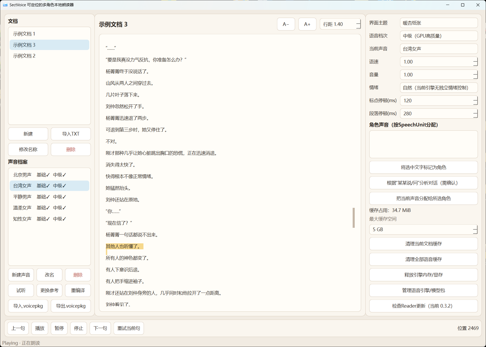
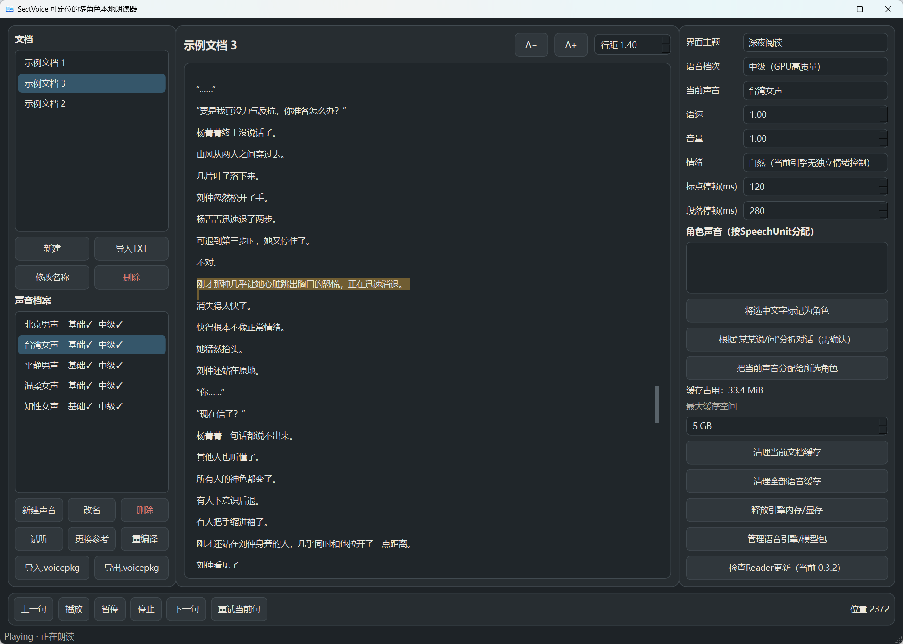
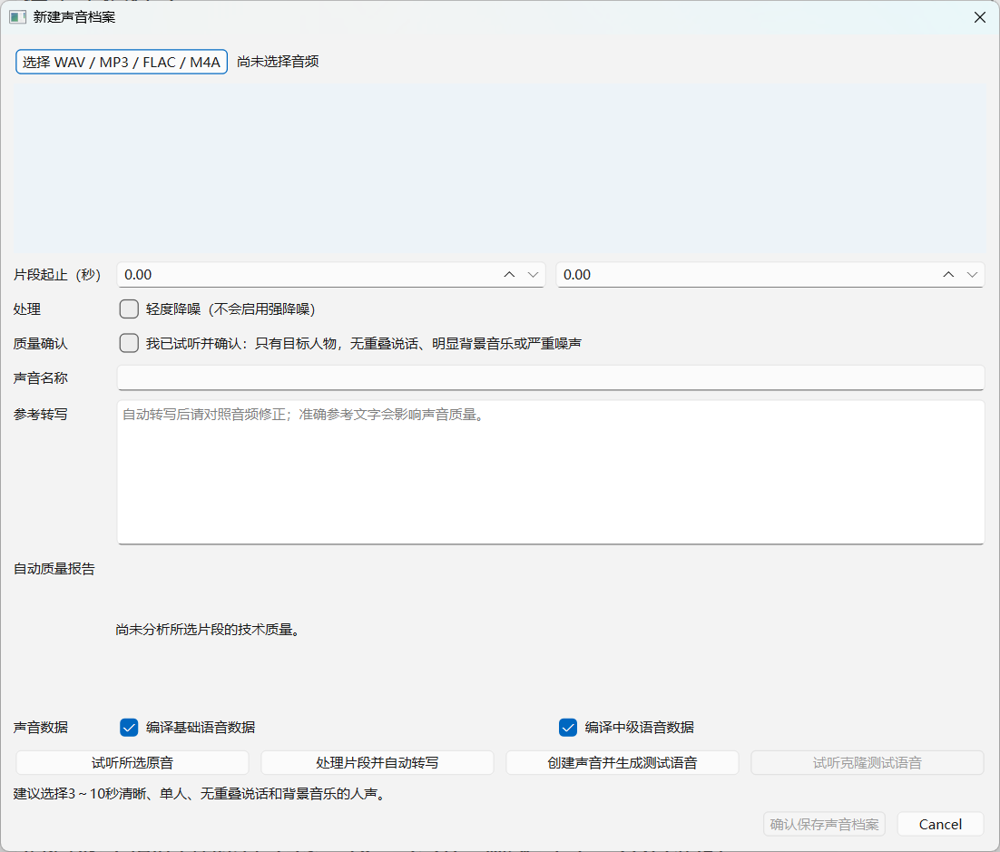
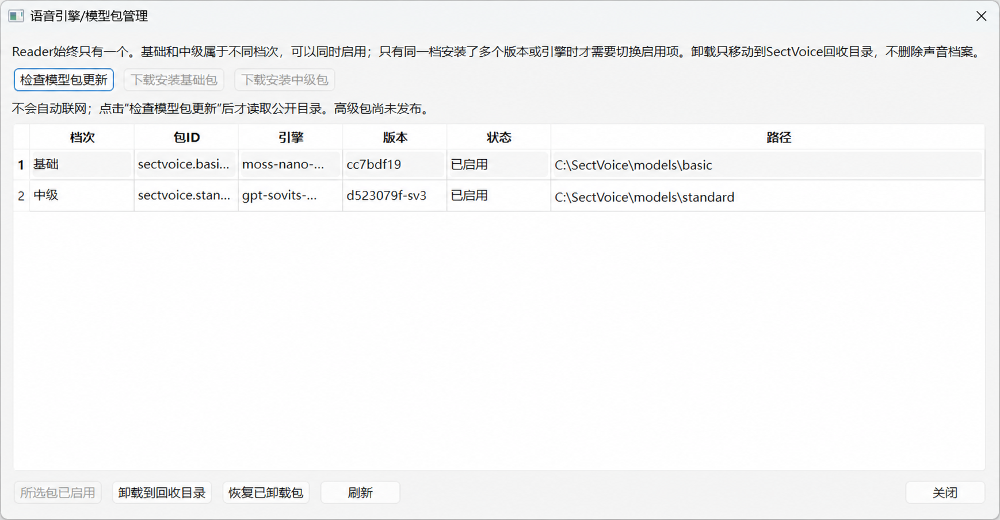

# SectVoice Reader

> 用自己有权使用的声音，在 Windows 上离线、连续地朗读长文本。

[下载 Windows 安装包](https://github.com/BestWishes/SectVoice-Downloads/releases/latest) · [English](README_EN.md) · [构建说明](BUILDING.md) · [许可证说明](MODEL_LICENSES.md)

SectVoice 不是“输入一段文字、等待生成一个 WAV”的配音工具。它是一个可日常使用的本地 Reader：声音只在创建或更换参考片段时编译一次；之后可直接朗读任意文本。Reader 一边播放当前窗口，一边准备后续内容，并支持双击正文任意位置立即停止旧会话、从新位置附近继续。

## 界面预览

### 暖杏纸张主题：连续朗读与双击跳转

### 深夜阅读主题：连续朗读与双击跳转

### 创建永久声音档案

### 独立安装或升级语音包

公开安装包内置“体验女声”和“体验男声”，首次启动后即可选择；它们来自 OpenMOSS/MOSS-TTS-Nano Apache-2.0 示例录音。除此之外，截图中的其它声音均为文档示例，安装包不包含用户声音、文档或数据库。详见 [BUILTIN_VOICES.md](BUILTIN_VOICES.md)。

## 主要能力

- 本地创建永久 `VoiceProfile`，以后朗读新文本不重复分析参考录音。
- 首次启动一次性导入体验女声和体验男声，两档均已有可复用 Payload；用户删除后不会被强制恢复。
- UTF-8 TXT 导入、直接粘贴、自动保存、恢复阅读位置、修改 Reader 内显示名称和删除文档。
- 暖杏纸张、柔和奶油、静谧青绿和深夜阅读四套主题，可即时切换并自动恢复上次选择。
- 播放、暂停、继续、停止、上一句、下一句、失败重试和跳过当前块。
- 当前朗读位置高亮、自动跟随滚动、双击任意字符跳转。
- 动态 `GenerationWindow`：多个极短句可合并，一个极长句可单独处理；不一次生成整本书。
- 旁白和角色可分配不同声音，映射保持在稳定 `SpeechUnitId` 上。
- Basic 与 Standard 是独立可选包，可安装、卸载、恢复、切换和升级。
- 模型推理、转写和媒体处理均不阻塞 Qt 主线程；引擎崩溃不会带崩 Reader。
- 文档、声音档案、模型、缓存和设置都保存在本机。

## 语音档次

| 档次 | 当前引擎 | 设备 | 适合场景 |
|---|---|---|---|
| Basic | MOSS-TTS-Nano 100M ONNX | CPU，建议至少 8 GB 内存 | 安装较小、无需 NVIDIA GPU |
| Standard | GPT-SoVITS v2ProPlus | NVIDIA CUDA，建议至少 4 GB 显存 | 更高质量的中文连续朗读 |
| Advanced | 未发布 | — | 仅保留协议扩展位 |

Reader 只有一个。Basic 和 Standard 是可独立安装的 Engine/Model Package，不是两套 Reader。

## 快速开始

1. 从 [Releases 下载页](https://github.com/BestWishes/SectVoice-Downloads/releases/latest) 下载 `SectVoice-Setup-<版本>-x64.exe` 与 `SHA256SUMS.txt`。
2. 核对 SHA-256 后运行安装器，选择 Reader Core，并按设备选择 Basic、Standard 或两者。
3. 首次启动完成环境检查。
4. 可以直接选择内置的体验女声或体验男声开始朗读，无需先准备参考录音。
5. 如需自己的声音，在“新建声音”中选择 3～10 秒清晰、单人、无重叠说话和明显背景音乐的参考片段，校正转写并保存。
6. 粘贴文字或导入 UTF-8 TXT，选择声音后播放；双击正文即可跳转。

项目当前有意不采用 Windows 代码签名，因此安装时可能显示“未知发布者”。这不影响 v0.3.3 的验收状态；请只从项目 Release 下载并核对 SHA-256。

## 从源码运行

参见 [BUILDING.md](BUILDING.md)。源码运行和正式分发都通过 `SECTVOICE_ROOT` 指定数据根目录；模型、虚拟环境、下载、声音、数据库和缓存不得提交到 Git。

## 架构入口

- [PRODUCT_SPEC.md](PRODUCT_SPEC.md)：产品边界和验收目标。
- [ARCHITECTURE.md](ARCHITECTURE.md)：Reader、VoiceCore、协议和数据流。
- [BENCHMARK_PLAN.md](BENCHMARK_PLAN.md)：语音引擎的选择与淘汰规则。
- [DISTRIBUTION_PLAN.md](DISTRIBUTION_PLAN.md)：安装器、模型包和升级设计。
- [VALIDATION_REPORT.md](VALIDATION_REPORT.md)：公开的真实本机验收摘要。

## 隐私与责任

SectVoice 不会把参考录音、转写、文档或生成语音上传到项目服务器；显式点击检查更新或下载语音包时才会访问 GitHub。请只克隆你有权使用的声音，不要用于冒充、欺诈、骚扰或绕过授权。详见 [PRIVACY.md](PRIVACY.md) 与 [RESPONSIBLE_USE.md](RESPONSIBLE_USE.md)。

## 许可证

SectVoice 自有源代码采用 [Apache License 2.0](LICENSE)，允许修改、再分发和闭源衍生开发，但必须保留许可证与适用的声明。

内置体验声音使用 OpenMOSS/MOSS-TTS-Nano 仓库的 Apache-2.0 示例音频并保留归属。引擎、模型、Qt/PySide6、FFmpeg、Rubber Band、ASR 模型及其它依赖保留各自许可证。当前官方 Windows 组合包含 GPLv3 FFmpeg 构建和 GPL 版 Rubber Band；重新分发该组合时必须履行相应 GPL 义务。希望发布闭源产品的下游开发者，应改用许可证兼容的媒体/变速组件，或自行取得 Rubber Band 商业许可。完整边界见 [THIRD_PARTY_NOTICES.md](THIRD_PARTY_NOTICES.md) 与 [MODEL_LICENSES.md](MODEL_LICENSES.md)。

## 贡献与安全

欢迎提交 Issue 和 Pull Request。请先阅读 [CONTRIBUTING.md](CONTRIBUTING.md)；安全问题请按 [SECURITY.md](SECURITY.md) 私下报告。
